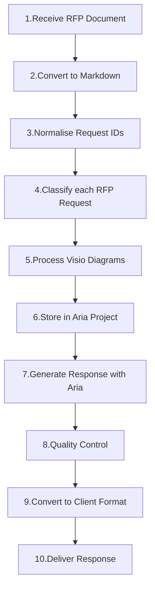

# Aria Riffs

Aria Riffs are independently distributed executable callables: bounded command-line programs that an Aria Agent discovers, reads, and invokes through the Riff primitive. Each Riff ships a `RIFF.md` the Agent reads before invoking, a `README.md` for people, and a developer-built `dist/cli.js` so Aria wires it without installing dependencies or compiling foreign source. This repository is Aria's official remote Riff Source.

## Source status

The three Source tiers are authority-qualified classifications:

- [`.system`](riffs/.system/) contains Aria-managed system-tier release units.
- [`.curated`](riffs/.curated/) contains Aria-curated release units.
- [`.experimental`](riffs/.experimental/) contains opt-in release units whose contracts may still evolve.

Every immediate child of a tier is one atomic downloadable release unit, except the reserved `_assets/` directory of tracked shared authoring assets. A Riff's identity is the `name` in its `RIFF.md` frontmatter and equals its directory name. Each populated tier carries its own hashed `manifest.yaml`. Capability domains, categories, assignments, and search tags are curated in `source.yaml`; directory names do not define them.

The latest GitHub release contains one built archive per release unit plus a signed `source.json`; superseded releases and tags are removed. Aria embeds the release pinned at its build and acquires later releases from GitHub, verifying Source authority, delegated signatures, receipts, archive digests, and the complete package index before installation. Runtime rollback uses locally retained immutable generations, and the GitHub URL is transport, not trust.

## API Keys

Some Riffs call model providers directly until they are plugged into the Aria gateway.

- <https://aistudio.google.com/app/api-keys>
- <https://platform.openai.com/api-keys>
- <https://platform.claude.com/settings/keys>
- <https://vercel.com/shaneholloman/~/ai-gateway/api-keys>

## Riffs

Each Riff runs during development via `bun riffs/.curated/<riff>/src/cli.ts`.

### Document Processing

| Riff                                                   | Purpose                                                             |
| ------------------------------------------------------ | ------------------------------------------------------------------- |
| [doc-converter](riffs/.curated/doc-converter/)         | DOCX to Markdown with 18 Aria Rules for normalization               |
| [doc-indexer](riffs/.curated/doc-indexer/)             | Document indexing, hybrid semantic/lexical search, knowledge graphs |
| [doc-decomposer](riffs/.curated/doc-decomposer/)       | Document analysis and component extraction                          |
| [mindmap-converter](riffs/.curated/mindmap-converter/) | OPML and FreeMind to Markdown conversion                            |
| [vector-indexer](riffs/.curated/vector-indexer/)       | Semantic vector search with Qwen3 models and Qdrant                 |

### Image Processing

| Riff                                                 | Purpose                                                        |
| ---------------------------------------------------- | -------------------------------------------------------------- |
| [image-generator](riffs/.curated/image-generator/)   | Image generation using Google Gemini API                       |
| [image-metadata](riffs/.curated/image-metadata/)     | AI-powered XMP metadata embedding via Ollama vision models     |
| [image-renamer](riffs/.curated/image-renamer/)       | AI-generated descriptive filenames (Ollama, Anthropic, Gemini) |
| [image-ocr](riffs/.curated/image-ocr/)               | Text extraction from images and PDFs using OCR                 |
| [image-transcoder](riffs/.curated/image-transcoder/) | Image optimization for LLM input size limits                   |
| [image-sanitiser](riffs/.curated/image-sanitiser/)   | File type detection and extension correction                   |
| [image-alttext](riffs/.curated/image-alttext/)       | Alt text generation from figure captions                       |

### Development Riffs

| Riff                                                 | Purpose                                            |
| ---------------------------------------------------- | -------------------------------------------------- |
| [code-auditor](riffs/.curated/code-auditor/)         | Dependency auditing with safe updates and rollback |
| [dir-differ](riffs/.curated/dir-differ/)             | Directory comparison for A/B testing               |
| [commit-formatter](riffs/.curated/commit-formatter/) | Git commit message formatting                      |
| [prompt-tracer](riffs/.curated/prompt-tracer/)       | Extract and compare Claude Code system prompts     |
| [riff-auditor](riffs/.curated/riff-auditor/)         | Structural and semantic parity across all Riffs    |

### Enterprise Integration

| Riff                                                     | Purpose                                                |
| -------------------------------------------------------- | ------------------------------------------------------ |
| [sharepoint-manager](riffs/.curated/sharepoint-manager/) | SharePoint link extraction from OneDrive-synced files  |
| [hr-staffer](riffs/.curated/hr-staffer/)                 | Organizational chart generation from staff directories |
| [hr-policy](riffs/.curated/hr-policy/)                   | HR policy decomposition, indexing, and semantic search |

## Architecture

### AI Provider Support

Riffs integrate with multiple AI providers:

- **Ollama** - Local models (LLaVA for vision tasks)
- **OpenAI** - Embeddings and completions
- **Anthropic** - Claude models
- **Gemini** - Google AI models

## Getting Started

### Prerequisites

- **Bun** - Runtime and package manager
- **Pandoc** - Required for doc-converter
- **Ollama** - Optional, for local AI models (LLaVA for vision tasks)
- **OpenAI API key** - Optional, for doc-indexer embeddings and image riffs

### Environment Setup

```sh
bun install
```

### Running Riffs

All Riffs follow the pattern `bun riffs/.curated/<riff>/src/cli.ts`:

```sh
# Document conversion
bun riffs/.curated/doc-converter/src/cli.ts input.docx output/

# Semantic search
bun riffs/.curated/doc-indexer/src/cli.ts search "authentication"

# Image processing
bun riffs/.curated/image-transcoder/src/cli.ts process ./images/

# Dependency audit
bun riffs/.curated/code-auditor/src/cli.ts audit
```

### Building Riff Distributions

Riff developers install dependencies and build the distributions that Aria consumes:

```sh
bun run build
```

Each package also exposes the same package-local build command. Aria prefers `dist/cli.js`; for a local development Riff whose distribution is absent, Aria's embedded Bun runtime can execute `src/cli.ts` without auto-installing packages. If that package is incomplete or broken, the Aria agent can inspect and repair it as ordinary repository work, refresh discovery, and retry it.

## Example Workflow



## Development

### Quality Checks

```sh
bun run test                        # Run all tests
bun run typecheck                   # Type check all riffs
bun run check                       # Biome lint + format check
bun run build                       # Build every Riff distribution
bun run quality                     # Run all quality checks including the Riff parity audit
bun scripts/source-check.ts riffs   # Inspect every tier, release unit, and the Source taxonomy
```

### Riff-Specific Commands

Each Riff owns its scripts in its package manifest. Run them from that Riff's package directory:

```sh
bun run --cwd riffs/.curated/doc-indexer test
bun run --cwd riffs/.curated/code-auditor audit
bun run --cwd riffs/.curated/image-transcoder typecheck
```

Use the root scripts above as the canonical development entrypoints for this repository. Further reading: [docs/riffs.md](docs/riffs.md) and [docs/cli-tui-pattern.md](docs/cli-tui-pattern.md).
