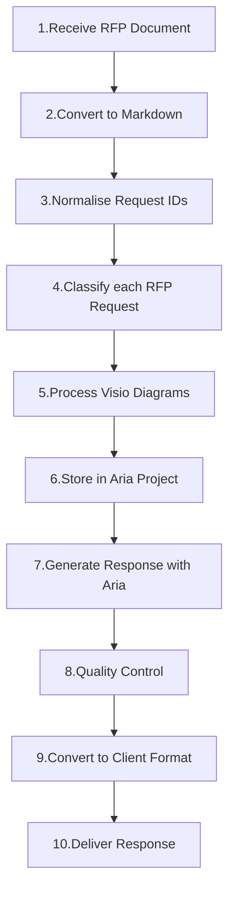

# Aria Riffs

## API Keys

To get started, you'll need some API keys until we have this plugged into our Aria gateway.

- <https://aistudio.google.com/app/api-keys>
- <https://platform.openai.com/api-keys>
- <https://platform.claude.com/settings/keys>
- <https://vercel.com/shaneholloman/~/ai-gateway/api-keys>

The riffs run in a CLI-first, zero-server workspace. During development, Bun executes each Riff's TypeScript source directly. Every published Riff also carries a developer-built `dist/cli.js` so Aria can wire it without installing dependencies or compiling foreign source. Each Riff handles a specific domain: document conversion, semantic search, image processing, organizational data, and enterprise integrations like SharePoint.

## Riffs

Aria provides independent CLI riffs organized by function. Each runs via `bun riffs/<riff>/src/cli.ts`.

### Document Processing

| Riff                                          | Purpose                                                             |
| --------------------------------------------- | ------------------------------------------------------------------- |
| [doc-converter](riffs/doc-converter/)         | DOCX to Markdown with 18 Aria Rules for normalization               |
| [doc-indexer](riffs/doc-indexer/)             | Document indexing, hybrid semantic/lexical search, knowledge graphs |
| [doc-decomposer](riffs/doc-decomposer/)       | Document analysis and component extraction                          |
| [mindmap-converter](riffs/mindmap-converter/) | OPML and FreeMind to Markdown conversion                            |
| [vector-indexer](riffs/vector-indexer/)       | Semantic vector search with Qwen3 models and Qdrant                 |

### Image Processing

| Riff                                        | Purpose                                                        |
| ------------------------------------------- | -------------------------------------------------------------- |
| [image-generator](riffs/image-generator/)   | Image generation using Google Gemini API                       |
| [image-metadata](riffs/image-metadata/)     | AI-powered XMP metadata embedding via Ollama vision models     |
| [image-renamer](riffs/image-renamer/)       | AI-generated descriptive filenames (Ollama, Anthropic, Gemini) |
| [image-ocr](riffs/image-ocr/)               | Text extraction from images and PDFs using OCR                 |
| [image-transcoder](riffs/image-transcoder/) | Image optimization for LLM input size limits                   |
| [image-sanitiser](riffs/image-sanitiser/)   | File type detection and extension correction                   |
| [image-alttext](riffs/image-alttext/)       | Alt text generation from figure captions                       |

### Development Riffs

| Riff                                        | Purpose                                            |
| ------------------------------------------- | -------------------------------------------------- |
| [code-auditor](./riffs/code-auditor)        | Dependency auditing with safe updates and rollback |
| [dir-differ](riffs/dir-differ/)             | Directory comparison for A/B testing               |
| [commit-formatter](riffs/commit-formatter/) | Git commit message formatting                      |
| [prompt-tracer](riffs/prompt-tracer/)       | Extract and compare Claude Code system prompts     |

### Enterprise Integration

| Riff                                            | Purpose                                                |
| ----------------------------------------------- | ------------------------------------------------------ |
| [sharepoint-manager](riffs/sharepoint-manager/) | SharePoint link extraction from OneDrive-synced files  |
| [hr-staffer](riffs/hr-staffer/)                 | Organizational chart generation from staff directories |
| [hr-policy](riffs/hr-policy/)                   | HR policy decomposition, indexing, and semantic search |

## Architecture

### AI Provider Support

Riffs integrate with multiple AI providers:

- **Ollama** - Local models (LLaVA for vision tasks)
- **OpenAI** - Embeddings and completions
- **Anthropic** - Claude models
- **Gemini** - Google AI models

## Getting Started

### Prerequisites

- **Node.js 26+** - Supported external runtime
- **Bun** - Package manager (preferred over npm/pnpm)
- **Pandoc** - Required for doc-converter riff
- **Ollama** - Optional, for local AI models (LLaVA for vision tasks)
- **OpenAI API key** - Optional, for doc-indexer embeddings and image riffs

### Environment Setup

```sh
bun install
```

### Running Riffs

All riffs follow the pattern `bun riffs/<riff>/src/cli.ts`:

```sh
# Document conversion
bun riffs/doc-converter/src/cli.ts input.docx output/

# Semantic search
bun riffs/doc-indexer/src/cli.ts search "authentication"

# Image processing
bun riffs/image-transcoder/src/cli.ts process ./images/

# Dependency audit
bun riffs/code-auditor/src/cli.ts audit
```

### Building Riff Distributions

Riff developers install dependencies and build the distributions that Aria consumes:

```sh
bun run build
```

Each package also exposes the same package-local build command. Aria prefers `dist/cli.js`; for a local development Riff whose distribution is absent, Aria's embedded Bun runtime can execute `src/cli.ts` without auto-installing packages. If that package is incomplete or broken, the Aria agent can inspect and repair it as ordinary repository work, refresh discovery, and retry it.

## Example Workflow



## Development

### Quality Checks

```sh
bun run test        # Run all tests
bun run typecheck   # Type check all riffs
bun run check       # Biome lint + format check
bun run build       # Build every Riff distribution
bun run quality     # Run all quality checks
```

### Riff-Specific Commands

Each Riff owns its scripts in its package manifest. Run them from that Riff's package directory:

```sh
bun run --cwd riffs/doc-indexer test
bun run --cwd riffs/code-auditor audit
bun run --cwd riffs/image-transcoder typecheck
```

Use the root scripts above as the canonical development entrypoints for this repository.
